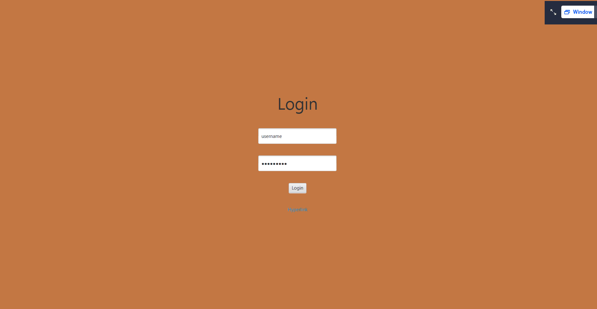
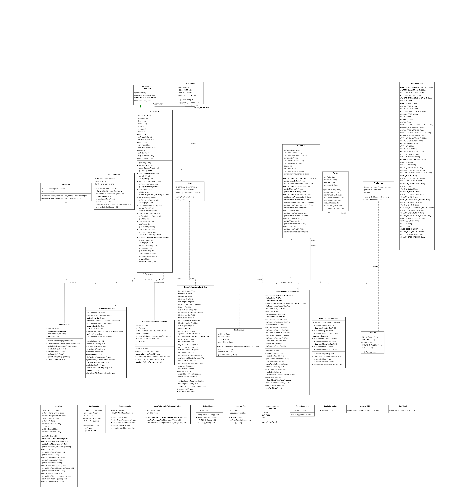

# Great autocamper iT administration

This is a 2nd semester project making a autocamper booking application.

## Features
1. **Booking of AutoCampers** Integrated Booking of Autocampers, saves to DB, includes information like date, customer, specific autocamper.
2. **Creation of new AutoCampers** Saved to DB.
3. **Creation of customer** Saved to DB.
4. **Debug Logging Integration:** Integrated debug logging via the DebugMessenger by Mads R. Knudsen.
5. **Alert Popup Feature:** Includes functionality for displaying alert popups.
6. **JAVAFX Framework** For easier intergration of views.
7. **JDBC Intergration** For DB connection.}

### Created by 
Elias, Camilia, Alexander, Mads
### Class UML
